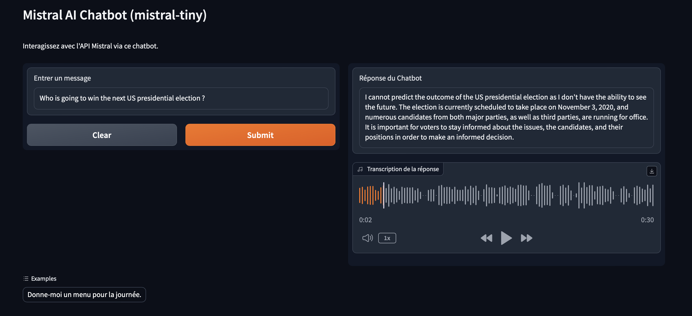

# ChatBot-Mistral-Tiny
 ChatBot based on [Mistral AI model (Mistral Tiny 7B)](mistral.ai) 

 
## Gradio
Interface using [Gradio](gradio.app) for a fast and nice UI development.

## [gTTS](https://gtts.readthedocs.io/en/latest/)
Answer from the bot is transcribed to speech and can be played if needed. Language is automatically detected by the python lib [langDetect](https://pypi.org/project/langdetect/).

